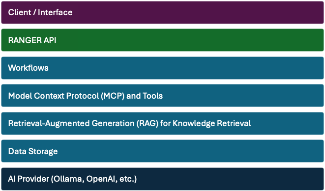

# Architecture and Core Components

Ranger’s architecture consists of several integrated components (both existing open-source tools and custom Ranger modules) that together enable its intelligent capabilities. The design emphasizes modularity and offline operation – each component can be deployed in containers, and all AI inference uses local models right out of the box. Below we describe the core components and integrations in Ranger’s architecture, including how they interact and why they were chosen.

The key infrastructure components are:

<ul>
    <li><strong><a href="user_interface">Client Interface</a></strong> – Web-based chat interface</li>
    <li><strong><a href="ranger_api">The Ranger API</a></strong> – The Ranger service</li>
    <li><strong><a href="workflows">Workflows</a></strong> – automations and task orchestration</li>
    <li><strong><a href="mcp">MCP</a></strong> – Model Context Protocol (MCP) and tool access</li>
    <li><strong><a href="rag">RAG</a></strong> – Retrieval-Augmented Generation (RAG) and vector search setup</li>
    <li><strong><a href="data_storage">Data Storage</a></strong> – Tabular data layer system</li>
    <li><strong><a href="ai_provider">AI Provider</a></strong> – Model backend (Ollama or other LLM)</li>
</ul>